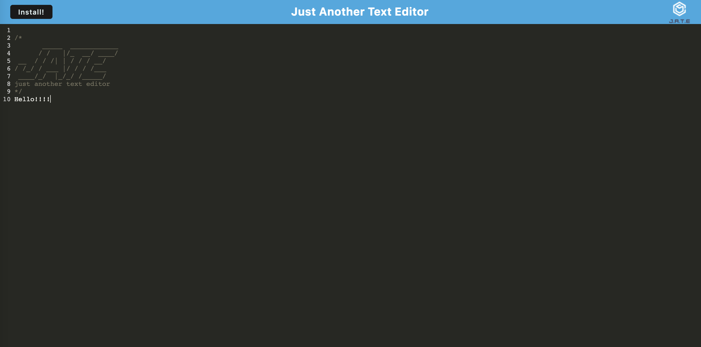

# Text_Editor

## Description

This text editor application is a Progressive Web App that allows a user to create and save notes and/or code snipets. The application can be installed to a user's local desktop and easily accessed even without internet connection via the use of service workers. 

## Installation

To install this application a user will need to download the code from the [Github Respository](https://github.com/annaperlack/Text_Editor). Then the user can run `npm install` in the command line in order to install all of the necessary modules and packages to start this application.

## Usage

The user can start this application by typing `npm run start` into the command line. The command line will notify to the user which local port this application is connected to.Once the application has been opened in the browser, the user can install it to their local desktop by clicking the `install` button. 

## Credits

N/A

## License

N/A